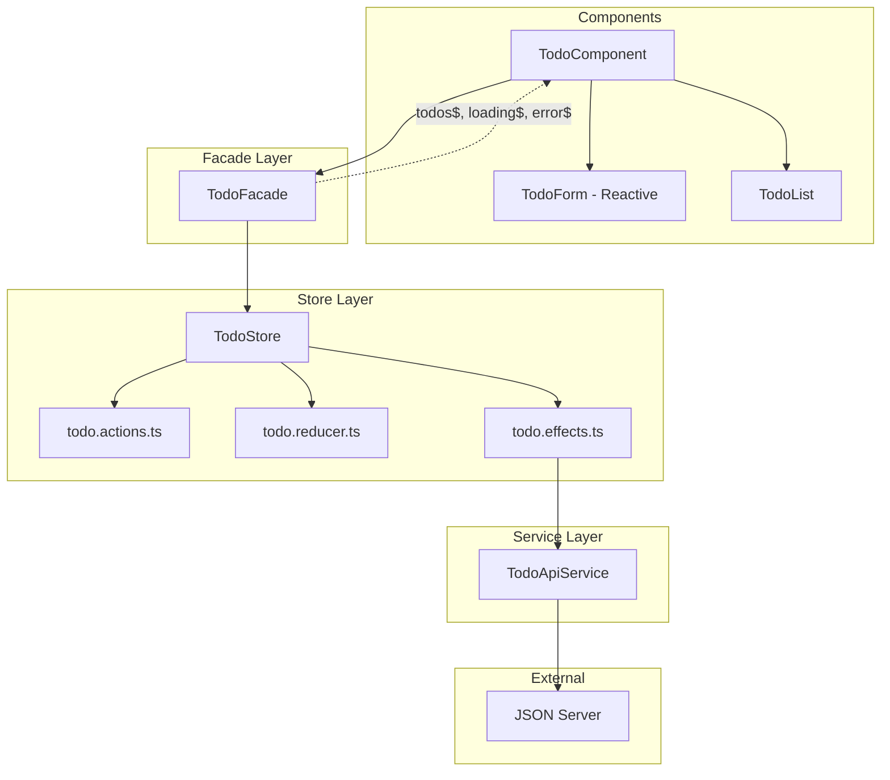

# Design Document: JSON Server RxJS Store

## Overview

Thiết kế hệ thống Todo sử dụng json-server làm REST API backend với RxJS store theo pattern NgRx-like. Architecture bao gồm:

- **Actions**: Định nghĩa các action types và creators
- **Reducer**: Pure function xử lý state changes
- **Effects**: Xử lý side effects (API calls)
- **Store**: Tổng hợp và quản lý state
- **Facade**: Lớp trung gian đơn giản hóa API cho components
- **Reactive Forms**: Form handling với validation

## Architecture



## Components and Interfaces

### Todo Interface

```typescript
interface Todo {
  id: string;
  title: string;
  completed: boolean;
}

interface TodoState {
  todos: Todo[];
  loading: boolean;
  error: string | null;
}
```

### Action Types and Creators (todo.actions.ts)

```typescript
// Action Types
const TodoActionTypes = {
  LOAD_TODOS: "[Todo] Load Todos",
  LOAD_TODOS_SUCCESS: "[Todo] Load Todos Success",
  LOAD_TODOS_FAILURE: "[Todo] Load Todos Failure",
  ADD_TODO: "[Todo] Add Todo",
  ADD_TODO_SUCCESS: "[Todo] Add Todo Success",
  ADD_TODO_FAILURE: "[Todo] Add Todo Failure",
  UPDATE_TODO: "[Todo] Update Todo",
  UPDATE_TODO_SUCCESS: "[Todo] Update Todo Success",
  UPDATE_TODO_FAILURE: "[Todo] Update Todo Failure",
  DELETE_TODO: "[Todo] Delete Todo",
  DELETE_TODO_SUCCESS: "[Todo] Delete Todo Success",
  DELETE_TODO_FAILURE: "[Todo] Delete Todo Failure",
} as const;

// Action Interface
interface Action<T = any> {
  type: string;
  payload?: T;
}

// Action Creators
function loadTodos(): Action;
function loadTodosSuccess(todos: Todo[]): Action<Todo[]>;
function loadTodosFailure(error: string): Action<string>;
function addTodo(title: string): Action<string>;
function addTodoSuccess(todo: Todo): Action<Todo>;
function addTodoFailure(error: string): Action<string>;
// ... similar for update and delete
```

### Reducer (todo.reducer.ts)

```typescript
const initialState: TodoState = {
  todos: [],
  loading: false,
  error: null,
};

function todoReducer(state: TodoState, action: Action): TodoState {
  switch (action.type) {
    case TodoActionTypes.LOAD_TODOS:
      return { ...state, loading: true, error: null };
    case TodoActionTypes.LOAD_TODOS_SUCCESS:
      return { ...state, todos: action.payload, loading: false };
    case TodoActionTypes.LOAD_TODOS_FAILURE:
      return { ...state, error: action.payload, loading: false };
    // ... handle other actions
    default:
      return state;
  }
}
```

### Effects (todo.effects.ts)

```typescript
class TodoEffects {
  constructor(private actions$: Subject<Action>, private apiService: TodoApiService, private store: TodoStore) {}

  loadTodos$ = this.actions$.pipe(
    filter((action) => action.type === TodoActionTypes.LOAD_TODOS),
    switchMap(() =>
      this.apiService.getTodos().pipe(
        map((todos) => loadTodosSuccess(todos)),
        catchError((error) => of(loadTodosFailure(error.message)))
      )
    )
  );
  // ... similar for other effects
}
```

### Store (todo.store.ts)

```typescript
class TodoStore {
  private state$ = new BehaviorSubject<TodoState>(initialState);
  private actions$ = new Subject<Action>();

  // Selectors
  todos$ = this.state$.pipe(map((state) => state.todos));
  loading$ = this.state$.pipe(map((state) => state.loading));
  error$ = this.state$.pipe(map((state) => state.error));

  dispatch(action: Action): void;
  getState(): TodoState;
}
```

### Facade (todo.facade.ts)

```typescript
class TodoFacade {
  todos$ = this.store.todos$;
  loading$ = this.store.loading$;
  error$ = this.store.error$;

  constructor(private store: TodoStore) {
    this.loadTodos();
  }

  loadTodos(): void;
  addTodo(title: string): void;
  updateTodo(id: string, updates: Partial<Todo>): void;
  toggleTodo(id: string): void;
  deleteTodo(id: string): void;
}
```

### API Service (todo-api.service.ts)

```typescript
class TodoApiService {
  private baseUrl = "http://localhost:3000/todos";

  constructor(private http: HttpClient) {}

  getTodos(): Observable<Todo[]>;
  addTodo(todo: Omit<Todo, "id">): Observable<Todo>;
  updateTodo(id: string, updates: Partial<Todo>): Observable<Todo>;
  deleteTodo(id: string): Observable<void>;
}
```

### Reactive Form

```typescript
// In TodoComponent
todoForm = new FormGroup({
  title: new FormControl('', [
    Validators.required,
    Validators.pattern(/\S+/)  // Not just whitespace
  ])
});

editingTodo: Todo | null = null;

onSubmit(): void {
  if (this.todoForm.valid) {
    const title = this.todoForm.get('title')?.value;
    if (this.editingTodo) {
      this.facade.updateTodo(this.editingTodo.id, { title });
    } else {
      this.facade.addTodo(title);
    }
    this.todoForm.reset();
    this.editingTodo = null;
  }
}
```

## Data Models

### State Structure

| Field   | Type        | Description          |
| ------- | ----------- | -------------------- |
| todos   | Todo[]      | Array of todo items  |
| loading | boolean     | API call in progress |
| error   | string/null | Error message if any |

### JSON Server Database (db.json)

```json
{
  "todos": [{ "id": "1", "title": "Sample Todo", "completed": false }]
}
```

## File Structure

```
src/app/
├── store/
│   └── todo/
│       ├── todo.actions.ts      # Action types & creators
│       ├── todo.reducer.ts      # Reducer function
│       ├── todo.effects.ts      # Side effects
│       ├── todo.store.ts        # Store service
│       └── todo.facade.ts       # Facade service
├── services/
│   └── todo-api.service.ts      # HTTP API service
├── models/
│   └── todo.model.ts            # Interfaces
└── components/
    └── todo/
        ├── todo.component.ts
        ├── todo.component.html
        └── todo.component.css
```

## Correctness Properties

_A property is a characteristic or behavior that should hold true across all valid executions of a system—essentially, a formal statement about what the system should do. Properties serve as the bridge between human-readable specifications and machine-verifiable correctness guarantees._

### Property 1: Action creators return correct structure

_For any_ action creator function and any valid payload, the returned action object SHALL have a `type` property matching the action type constant and a `payload` property (if provided) containing the input data.

**Validates: Requirements 2.3**

### Property 2: Reducer is a pure function

_For any_ state and action, calling the reducer multiple times with the same inputs SHALL always produce the same output, and the original state SHALL remain unchanged (immutability).

**Validates: Requirements 3.1**

### Property 3: Reducer handles CRUD operations correctly

_For any_ valid TodoState and corresponding success action:

- LOAD_TODOS_SUCCESS: todos array SHALL equal the payload
- ADD_TODO_SUCCESS: todos array length SHALL increase by 1 and contain the new todo
- UPDATE_TODO_SUCCESS: only the matching todo SHALL be modified
- DELETE_TODO_SUCCESS: todos array length SHALL decrease by 1 and not contain the deleted todo

**Validates: Requirements 3.3, 3.4, 3.5, 3.6**

### Property 4: Reducer manages loading and error states

_For any_ action that starts an async operation (LOAD_TODOS, ADD_TODO, UPDATE_TODO, DELETE_TODO), loading SHALL be true and error SHALL be null. _For any_ success action, loading SHALL be false. _For any_ failure action, loading SHALL be false and error SHALL contain the error message.

**Validates: Requirements 3.7, 3.8**

### Property 5: Effects dispatch correct actions on API response

_For any_ API call triggered by an effect, a successful response SHALL result in dispatching the corresponding SUCCESS action, and an error response SHALL result in dispatching the corresponding FAILURE action with error message.

**Validates: Requirements 4.6**

### Property 6: API Service returns Observables

_For any_ method call on TodoApiService (getTodos, addTodo, updateTodo, deleteTodo), the return value SHALL be an Observable.

**Validates: Requirements 7.3**

### Property 7: Form validation rejects empty/whitespace titles

_For any_ string that is empty or contains only whitespace characters, the form SHALL be invalid and submission SHALL be prevented.

**Validates: Requirements 8.3**

### Property 8: Form populates correctly when editing

_For any_ todo being edited, the form's title control SHALL contain that todo's title value.

**Validates: Requirements 8.5**

### Property 9: Form resets after successful submission

_For any_ successful form submission (add or update), the form SHALL be reset to its initial empty state.

**Validates: Requirements 8.6**

### Property 10: Component displays loading state

_For any_ state where loading is true, the component SHALL display a loading indicator.

**Validates: Requirements 9.7**

### Property 11: Component displays error state

_For any_ state where error is not null, the component SHALL display the error message to the user.

**Validates: Requirements 9.6**

## Error Handling

| Error Case              | Handling Strategy                           |
| ----------------------- | ------------------------------------------- |
| API connection failure  | Dispatch FAILURE action, show error message |
| Invalid todo title      | Form validation prevents submission         |
| Server error (4xx, 5xx) | Dispatch FAILURE action, show error message |
| Network timeout         | Dispatch FAILURE action, show retry option  |

## Testing Strategy

### Unit Tests

- Test action creators return correct structure
- Test reducer handles each action type
- Test facade methods dispatch correct actions
- Test form validation rules
- Test API service methods with HttpClientTestingModule

### Property-Based Tests

- Use fast-check library for property-based testing
- Minimum 100 iterations per property test
- Test reducer purity and state transitions
- Test form validation across input space

### Integration Tests

- Test effects with mocked API responses
- Test component integration with facade
- Test full flow from UI action to state update

### Test Configuration

```typescript
// Install dependencies
// npm install --save-dev fast-check @angular/common/http/testing

// Each property test should be tagged:
// Feature: json-server-rxjs-store, Property N: [property description]
```
