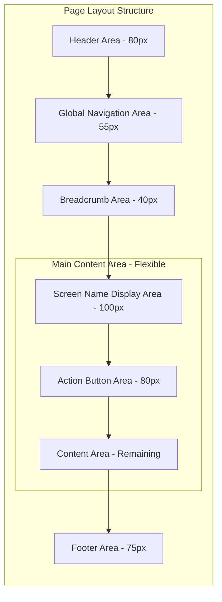

# Design Document: Page Layout System

## Overview

This design implements a standardized page layout framework for the Angular application. The layout provides a consistent visual structure with fixed-height header, navigation, breadcrumb, and footer areas, plus a flexible main content area. The system is built as reusable Angular components using content projection for maximum flexibility.

## Architecture



### Component Hierarchy

```
AppComponent
└── PageLayoutComponent (structural container)
    ├── <ng-content select="[header]"> → HeaderComponent
    ├── <ng-content select="[navigation]"> → NavigationComponent
    ├── <ng-content select="[breadcrumb]"> → BreadcrumbComponent
    ├── MainContentComponent
    │   ├── <ng-content select="[screenName]">
    │   ├── <ng-content select="[actions]">
    │   └── <ng-content select="[content]">
    └── <ng-content select="[footer]"> → FooterComponent
```

## Components and Interfaces

### 1. PageLayoutComponent (Container)

```typescript
@Component({
  selector: "app-page-layout",
  standalone: true,
  changeDetection: ChangeDetectionStrategy.OnPush,
})
export class PageLayoutComponent {
  // Configuration inputs
  @Input() showBreadcrumb: boolean = true;
  @Input() showActionArea: boolean = true;

  // CSS custom property overrides
  @Input() headerHeight: string = "80px";
  @Input() navigationHeight: string = "55px";
  @Input() breadcrumbHeight: string = "40px";
  @Input() screenNameHeight: string = "100px";
  @Input() actionAreaHeight: string = "80px";
  @Input() footerHeight: string = "75px";
}
```

**Template Structure:**

```html
<div class="page-layout" [style.--header-height]="headerHeight" ...>
  <header class="layout-header">
    <ng-content select="[header]"></ng-content>
  </header>

  <nav class="layout-navigation">
    <ng-content select="[navigation]"></ng-content>
  </nav>

  <div class="layout-breadcrumb" *ngIf="showBreadcrumb">
    <ng-content select="[breadcrumb]"></ng-content>
  </div>

  <main class="layout-main">
    <div class="screen-name-area">
      <ng-content select="[screenName]"></ng-content>
    </div>

    <div class="action-area" *ngIf="showActionArea">
      <ng-content select="[actions]"></ng-content>
    </div>

    <div class="content-area">
      <ng-content select="[content]"></ng-content>
    </div>
  </main>

  <footer class="layout-footer">
    <ng-content select="[footer]"></ng-content>
  </footer>
</div>
```

### 2. HeaderComponent (Presentational)

```typescript
@Component({
  selector: "app-header",
  standalone: true,
  changeDetection: ChangeDetectionStrategy.OnPush,
})
export class HeaderComponent {
  @Input() title: string = "";
  @Input() logoUrl: string = "";

  @Output() logoClick = new EventEmitter<void>();
}
```

### 3. NavigationComponent (Presentational)

```typescript
export interface NavItem {
  label: string;
  route: string;
  icon?: string;
  active?: boolean;
}

@Component({
  selector: "app-navigation",
  standalone: true,
  changeDetection: ChangeDetectionStrategy.OnPush,
})
export class NavigationComponent {
  @Input() items: NavItem[] = [];
  @Input() activeRoute: string = "";

  @Output() navigate = new EventEmitter<string>();
}
```

### 4. BreadcrumbComponent (Presentational)

```typescript
export interface BreadcrumbItem {
  label: string;
  route?: string;
}

@Component({
  selector: "app-breadcrumb",
  standalone: true,
  changeDetection: ChangeDetectionStrategy.OnPush,
})
export class BreadcrumbComponent {
  @Input() items: BreadcrumbItem[] = [];

  @Output() navigate = new EventEmitter<string>();
}
```

### 5. FooterComponent (Presentational)

```typescript
@Component({
  selector: "app-footer",
  standalone: true,
  changeDetection: ChangeDetectionStrategy.OnPush,
})
export class FooterComponent {
  @Input() copyright: string = "";
  @Input() links: { label: string; url: string }[] = [];
}
```

## Data Models

```typescript
// src/app/shared/models/layout.model.ts

export interface LayoutConfig {
  headerHeight: string;
  navigationHeight: string;
  breadcrumbHeight: string;
  screenNameHeight: string;
  actionAreaHeight: string;
  footerHeight: string;
}

export const DEFAULT_LAYOUT_CONFIG: LayoutConfig = {
  headerHeight: "80px",
  navigationHeight: "55px",
  breadcrumbHeight: "40px",
  screenNameHeight: "100px",
  actionAreaHeight: "80px",
  footerHeight: "75px",
};

export interface NavItem {
  label: string;
  route: string;
  icon?: string;
  active?: boolean;
}

export interface BreadcrumbItem {
  label: string;
  route?: string;
}
```

## CSS Architecture

```css
/* src/app/shared/components/page-layout/page-layout.component.css */

:host {
  --header-height: 80px;
  --navigation-height: 55px;
  --breadcrumb-height: 40px;
  --screen-name-height: 100px;
  --action-area-height: 80px;
  --footer-height: 75px;
  --title-bar-height: 73px;
}

.page-layout {
  display: flex;
  flex-direction: column;
  min-height: 100vh;
  height: 100vh;
}

.layout-header {
  height: var(--header-height);
  flex-shrink: 0;
}

.layout-navigation {
  height: var(--navigation-height);
  flex-shrink: 0;
}

.layout-breadcrumb {
  height: var(--breadcrumb-height);
  flex-shrink: 0;
}

.layout-main {
  flex: 1;
  display: flex;
  flex-direction: column;
  overflow: hidden;
}

.screen-name-area {
  height: var(--screen-name-height);
  flex-shrink: 0;
}

.action-area {
  height: var(--action-area-height);
  flex-shrink: 0;
}

.content-area {
  flex: 1;
  overflow-y: auto;
}

.layout-footer {
  height: var(--footer-height);
  flex-shrink: 0;
}
```

## Correctness Properties

_A property is a characteristic or behavior that should hold true across all valid executions of a system-essentially, a formal statement about what the system should do. Properties serve as the bridge between human-readable specifications and machine-verifiable correctness guarantees._

### Property 1: Fixed-height areas maintain specified heights

_For any_ layout area with a specified fixed height (Header: 80px, Navigation: 55px, Breadcrumb: 40px, Screen Name: 100px, Action Area: 80px, Footer: 75px), THE rendered element SHALL have a computed height equal to the specified value.
**Validates: Requirements 1.1, 2.1, 3.1, 4.4, 4.5, 5.1**

### Property 2: Fixed heights are maintained across viewport widths

_For any_ viewport width, THE fixed-height layout areas (Header, Navigation, Breadcrumb, Footer) SHALL maintain their specified heights regardless of viewport width changes.
**Validates: Requirements 1.4, 2.4, 3.4, 5.4, 6.3**

### Property 3: Main content area fills remaining space

_For any_ viewport height, THE Main_Content_Area height SHALL equal the viewport height minus the sum of all fixed-height areas (Header + Navigation + Breadcrumb + Footer), and THE content-area within Main_Content_Area SHALL enable vertical scrolling when content exceeds available space.
**Validates: Requirements 4.1, 4.3, 6.1, 6.2**

### Property 4: Content projection renders in correct slots

_For any_ content projected into the PageLayoutComponent using selector attributes (header, navigation, breadcrumb, screenName, actions, content, footer), THE projected content SHALL appear within the corresponding layout area element.
**Validates: Requirements 7.2**

### Property 5: Optional areas can be hidden via inputs

_For any_ boolean value passed to showBreadcrumb or showActionArea inputs, WHEN the value is false, THE corresponding layout area SHALL NOT be rendered in the DOM, AND WHEN the value is true, THE corresponding layout area SHALL be rendered.
**Validates: Requirements 7.3, 7.4**

## Error Handling

- **Missing projected content**: Layout areas without projected content will render empty but maintain their height
- **Invalid height inputs**: If custom height inputs are provided with invalid CSS values, fall back to default values
- **Viewport too small**: Maintain minimum heights for fixed areas; main content area may become scrollable or collapse to minimum height

## Testing Strategy

### Unit Tests (Component Tests)

- Test PageLayoutComponent renders all layout areas
- Test content projection works for each slot
- Test showBreadcrumb and showActionArea inputs hide/show areas
- Test custom height inputs override default values
- Test HeaderComponent, NavigationComponent, BreadcrumbComponent, FooterComponent render correctly

### Property-Based Tests

- Property 1: Generate random layout configurations and verify all fixed heights
- Property 2: Generate random viewport widths and verify heights remain constant
- Property 3: Generate random viewport heights and verify main content calculation
- Property 4: Generate random content and verify projection to correct slots
- Property 5: Generate random boolean combinations for optional areas

### Integration Tests

- Test full page layout with all components integrated
- Test layout behavior during navigation
- Test responsive behavior across breakpoints

### Testing Framework

- Jasmine/Karma (Angular default)
- fast-check for property-based testing
- @angular/cdk/testing for component harnesses
