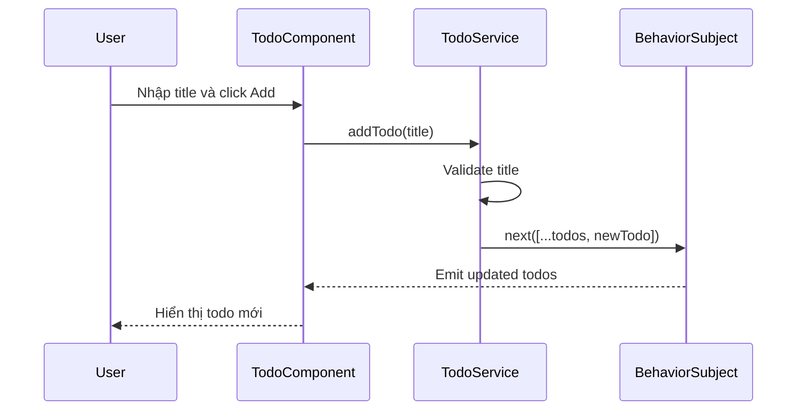
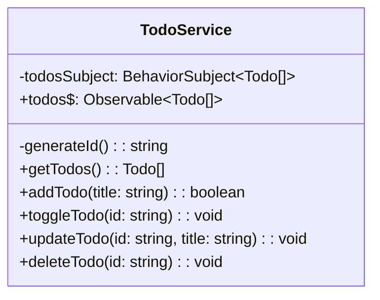
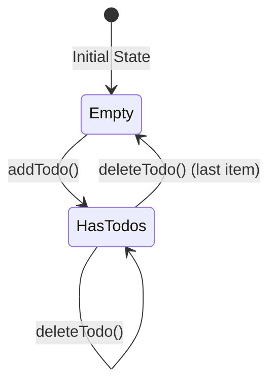
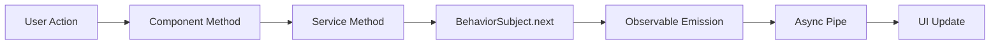
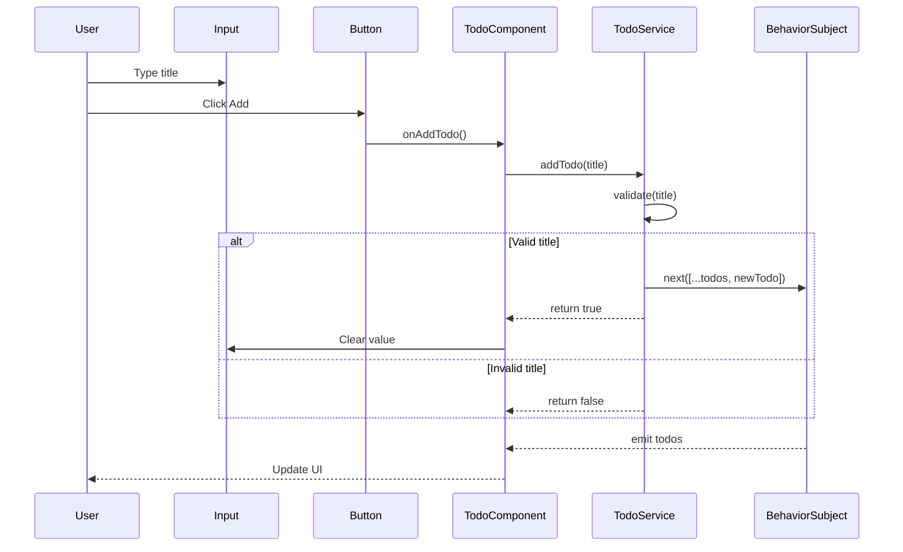
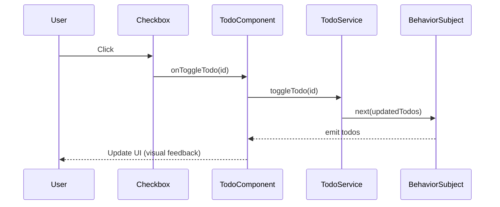

# Detail Design Document: RxJS Todo CRUD Application

## 1. Tổng quan

### 1.1 Mục đích

Tài liệu này mô tả chi tiết thiết kế kỹ thuật của ứng dụng Todo CRUD sử dụng Angular với RxJS để quản lý state reactive. Ứng dụng cho phép người dùng thực hiện các thao tác CRUD (Create, Read, Update, Delete) trên danh sách công việc.

### 1.2 Phạm vi

- Quản lý state reactive với RxJS BehaviorSubject
- UI components sử dụng PrimeNG
- Property-based testing với fast-check

### 1.3 Công nghệ sử dụng

| Công nghệ  | Phiên bản | Mục đích                  |
| ---------- | --------- | ------------------------- |
| Angular    | 17.x      | Framework chính           |
| RxJS       | 7.x       | Reactive state management |
| PrimeNG    | 17.x      | UI Components             |
| fast-check | 3.x       | Property-based testing    |
| TypeScript | 5.x       | Ngôn ngữ lập trình        |

---

## 2. Kiến trúc hệ thống

### 2.1 Architecture Diagram

```mermaid
graph TB
    subgraph "Presentation Layer"
        AC[AppComponent]
        TC[TodoComponent]
        TF[Todo Form - InputGroup]
        TL[Todo List - Card]
        TI[Todo Item - Checkbox + Button]
    end

    subgraph "Service Layer"
        TS[TodoService]
        BS[(BehaviorSubject<Todo[]>)]
    end

    subgraph "Data Layer"
        TM[Todo Model/Interface]
    end

    AC --> TC
    TC --> TF
    TC --> TL
    TL --> TI

    TF -->|addTodo| TS
    TI -->|toggleTodo| TS
    TI -->|updateTodo| TS
    TI -->|deleteTodo| TS

    TS --> BS
    BS -->|todos$ Observable| TC
    TS --> TM
```

### 2.2 Component Hierarchy

```
AppComponent
└── TodoComponent
    ├── Todo Form (p-inputGroup)
    │   ├── Input Text (pInputText)
    │   └── Add Button (pButton)
    └── Todo List (p-card)
        └── Todo Item (ngFor)
            ├── Checkbox (p-checkbox)
            ├── Title (span / pInputText khi edit)
            └── Delete Button (pButton)
```

### 2.3 Data Flow



---

## 3. Chi tiết thiết kế

### 3.1 Data Models

#### 3.1.1 Todo Interface

**File:** `src/app/models/todo.model.ts`

```typescript
export interface Todo {
  id: string; // UUID unique identifier
  title: string; // Nội dung công việc
  completed: boolean; // Trạng thái hoàn thành
}
```

| Field     | Type    | Constraints                   | Description                     |
| --------- | ------- | ----------------------------- | ------------------------------- |
| id        | string  | Required, Unique, UUID format | Định danh duy nhất cho mỗi todo |
| title     | string  | Required, Non-empty, Trimmed  | Tiêu đề/nội dung của todo       |
| completed | boolean | Required, Default: false      | Trạng thái hoàn thành           |

---

### 3.2 Service Layer

#### 3.2.1 TodoService

**File:** `src/app/services/todo.service.ts`

**Mục đích:** Quản lý state của todos sử dụng RxJS BehaviorSubject, cung cấp các phương thức CRUD.

##### Class Diagram



##### Properties

| Property     | Type                    | Access  | Description                        |
| ------------ | ----------------------- | ------- | ---------------------------------- |
| todosSubject | BehaviorSubject<Todo[]> | private | Lưu trữ state của todos            |
| todos$       | Observable<Todo[]>      | public  | Observable để components subscribe |

##### Methods

**generateId()**

```typescript
private generateId(): string
```

- **Mục đích:** Tạo UUID unique cho todo mới
- **Return:** string - UUID format
- **Implementation:** Sử dụng `crypto.randomUUID()`

**getTodos()**

```typescript
getTodos(): Todo[]
```

- **Mục đích:** Lấy snapshot hiện tại của todos
- **Return:** Todo[] - Mảng todos hiện tại
- **Use case:** Testing, debugging

**addTodo(title: string)**

```typescript
addTodo(title: string): boolean
```

- **Mục đích:** Thêm todo mới vào danh sách
- **Parameters:**
  - `title`: string - Tiêu đề của todo
- **Return:** boolean - true nếu thành công, false nếu validation fail
- **Validation:**
  - Reject nếu title null/undefined
  - Reject nếu title.trim() rỗng
- **Flow:**
  ```
  1. Validate title (non-empty, non-whitespace)
  2. Nếu invalid → return false
  3. Tạo Todo object mới với:
     - id: generateId()
     - title: title.trim()
     - completed: false
  4. Emit [...currentTodos, newTodo]
  5. Return true
  ```

**toggleTodo(id: string)**

```typescript
toggleTodo(id: string): void
```

- **Mục đích:** Đảo trạng thái completed của todo
- **Parameters:**
  - `id`: string - ID của todo cần toggle
- **Flow:**
  ```
  1. Map qua todos
  2. Nếu todo.id === id → flip completed
  3. Emit updated todos
  ```

**updateTodo(id: string, title: string)**

```typescript
updateTodo(id: string, title: string): void
```

- **Mục đích:** Cập nhật title của todo
- **Parameters:**
  - `id`: string - ID của todo cần update
  - `title`: string - Title mới
- **Flow:**
  ```
  1. Map qua todos
  2. Nếu todo.id === id → update title
  3. Emit updated todos
  ```

**deleteTodo(id: string)**

```typescript
deleteTodo(id: string): void
```

- **Mục đích:** Xóa todo khỏi danh sách
- **Parameters:**
  - `id`: string - ID của todo cần xóa
- **Flow:**
  ```
  1. Filter todos, loại bỏ todo có id matching
  2. Emit filtered todos
  ```

---

### 3.3 Component Layer

#### 3.3.1 TodoComponent

**File:** `src/app/components/todo/todo.component.ts`

**Mục đích:** Component chính hiển thị form và danh sách todos.

##### Component Metadata

```typescript
@Component({
  selector: 'app-todo',
  standalone: true,
  imports: [
    CommonModule,
    FormsModule,
    InputTextModule,
    ButtonModule,
    CheckboxModule,
    CardModule,
    InputGroupModule,
    InputGroupAddonModule,
  ],
  templateUrl: './todo.component.html',
  styleUrl: './todo.component.css',
})
```

##### Properties

| Property      | Type               | Default | Description               |
| ------------- | ------------------ | ------- | ------------------------- |
| todos$        | Observable<Todo[]> | -       | Observable từ TodoService |
| newTodoTitle  | string             | ''      | Binding cho input field   |
| editingTodoId | string \| null     | null    | ID của todo đang edit     |
| editingTitle  | string             | ''      | Title đang edit           |

##### Methods

| Method        | Parameters                       | Return | Description                 |
| ------------- | -------------------------------- | ------ | --------------------------- |
| ngOnInit      | -                                | void   | Subscribe todos$ từ service |
| onAddTodo     | -                                | void   | Thêm todo mới, clear input  |
| onToggleTodo  | id: string                       | void   | Toggle completed status     |
| onDeleteTodo  | id: string                       | void   | Xóa todo                    |
| onStartEdit   | todo: Todo                       | void   | Bắt đầu edit mode           |
| onSaveEdit    | id: string                       | void   | Lưu edit, exit edit mode    |
| cancelEdit    | -                                | void   | Hủy edit mode               |
| onEditKeydown | event: KeyboardEvent, id: string | void   | Handle Enter/Escape         |

##### Template Structure

```html
<p-card header="Todo List">
  <!-- Form Section -->
  <div class="todo-form">
    <p-inputGroup>
      <input pInputText [(ngModel)]="newTodoTitle" />
      <button pButton (click)="onAddTodo()">Add</button>
    </p-inputGroup>
  </div>

  <!-- List Section -->
  <div class="todo-list">
    @for (todo of todos$ | async; track todo.id) {
    <div class="todo-item">
      <p-checkbox (onChange)="onToggleTodo(todo.id)" />
      <!-- Title or Edit Input -->
      <button pButton (click)="onDeleteTodo(todo.id)" />
    </div>
    }
  </div>
</p-card>
```

---

### 3.4 PrimeNG Components Usage

| Component  | Module           | Usage                   |
| ---------- | ---------------- | ----------------------- |
| Card       | CardModule       | Container cho todo list |
| InputText  | InputTextModule  | Input field cho title   |
| Button     | ButtonModule     | Add, Delete buttons     |
| Checkbox   | CheckboxModule   | Toggle completed        |
| InputGroup | InputGroupModule | Group input + button    |

---

## 4. State Management

### 4.1 State Flow Diagram



### 4.2 State Structure

```typescript
// Initial State
const initialState: Todo[] = [];

// State after operations
interface StateSnapshot {
  todos: Todo[];
  timestamp: number;
}
```

### 4.3 Reactive Pattern



---

## 5. User Interface Design

### 5.1 Layout Structure

```
┌─────────────────────────────────────────┐
│              Todo List                   │
├─────────────────────────────────────────┤
│ ┌─────────────────────────────┐ ┌─────┐ │
│ │ Enter a new todo...         │ │ Add │ │
│ └─────────────────────────────┘ └─────┘ │
├─────────────────────────────────────────┤
│ ☐ Todo item 1                      🗑️  │
│ ☑ Todo item 2 (completed)          🗑️  │
│ ☐ Todo item 3                      🗑️  │
└─────────────────────────────────────────┘
```

### 5.2 CSS Classes

| Class                | Purpose                     |
| -------------------- | --------------------------- |
| .todo-card           | Card container styling      |
| .todo-form           | Form section spacing        |
| .todo-input          | Input field flex grow       |
| .todo-list           | List container flex column  |
| .todo-item           | Individual item styling     |
| .todo-item.completed | Completed item background   |
| .todo-title          | Title text styling          |
| .completed-text      | Strikethrough for completed |
| .edit-input          | Inline edit input           |
| .delete-btn          | Delete button opacity       |
| .empty-state         | Empty list message          |

### 5.3 Visual States

| State     | Visual Feedback                      |
| --------- | ------------------------------------ |
| Normal    | White background, subtle border      |
| Hover     | Light gray background, shadow        |
| Completed | Green background, strikethrough text |
| Editing   | Input field replaces title           |
| Empty     | Icon + message centered              |

---

## 6. Error Handling

### 6.1 Validation Rules

| Input            | Validation                | Error Handling                |
| ---------------- | ------------------------- | ----------------------------- |
| Empty title      | title.trim().length === 0 | Return false, no state change |
| Whitespace title | title.trim().length === 0 | Return false, no state change |
| Non-existent ID  | ID not found in list      | No-op, maintain state         |

### 6.2 Edge Cases

| Case                | Behavior                             |
| ------------------- | ------------------------------------ |
| Add to empty list   | Creates first todo                   |
| Delete last item    | Returns to empty state               |
| Toggle non-existent | No change                            |
| Update non-existent | No change                            |
| Rapid operations    | BehaviorSubject handles sequentially |

---

## 7. Testing Strategy

### 7.1 Property-Based Tests

| Property | Description                       | Validates |
| -------- | --------------------------------- | --------- |
| P1       | Adding valid todo grows list by 1 | Req 1.1   |
| P2       | Empty/whitespace rejected         | Req 1.2   |
| P3       | Toggle flips completed            | Req 3.1   |
| P4       | Update changes only target title  | Req 3.2   |
| P5       | Delete removes exactly one        | Req 4.1   |

### 7.2 Test Configuration

```typescript
// fast-check configuration
fc.assert(
  fc.property(/* arbitraries */, /* predicate */),
  { numRuns: 100 }
);
```

### 7.3 Unit Tests

- Service creation
- Multiple todo operations
- Component rendering
- User interactions

---

## 8. File Structure

```
src/app/
├── models/
│   └── todo.model.ts          # Todo interface
├── services/
│   ├── todo.service.ts        # TodoService implementation
│   └── todo.service.spec.ts   # Service tests
├── components/
│   └── todo/
│       ├── todo.component.ts      # Component logic
│       ├── todo.component.html    # Template
│       ├── todo.component.css     # Styles
│       └── todo.component.spec.ts # Component tests
├── app.component.ts
├── app.component.html
├── app.config.ts              # PrimeNG configuration
└── app.routes.ts
```

---

## 9. Dependencies

### 9.1 Package Dependencies

```json
{
  "dependencies": {
    "primeng": "^17.x",
    "primeicons": "^7.x"
  },
  "devDependencies": {
    "fast-check": "^3.x"
  }
}
```

### 9.2 Angular Configuration

```json
// angular.json styles
"styles": [
  "node_modules/primeng/resources/themes/lara-light-blue/theme.css",
  "node_modules/primeng/resources/primeng.min.css",
  "node_modules/primeicons/primeicons.css"
]
```

---

## 10. Appendix

### 10.1 Sequence Diagrams

#### Add Todo Flow



#### Toggle Todo Flow



### 10.2 Requirements Traceability Matrix

| Requirement         | Design Section   | Implementation      | Test |
| ------------------- | ---------------- | ------------------- | ---- |
| 1.1 Add todo        | 3.2.1 addTodo    | todo.service.ts     | P1   |
| 1.2 Reject empty    | 3.2.1 addTodo    | todo.service.ts     | P2   |
| 1.3 Clear input     | 3.3.1 onAddTodo  | todo.component.ts   | Unit |
| 2.1 Display list    | 3.3.1 Template   | todo.component.html | Unit |
| 2.2 Auto update     | 3.3.1 todos$     | todo.component.ts   | P6   |
| 2.3 Show status     | 3.3.1 Template   | todo.component.html | Unit |
| 3.1 Toggle          | 3.2.1 toggleTodo | todo.service.ts     | P3   |
| 3.2 Update title    | 3.2.1 updateTodo | todo.service.ts     | P4   |
| 3.3 Reflect changes | 3.3.1 todos$     | todo.component.ts   | P6   |
| 4.1 Delete          | 3.2.1 deleteTodo | todo.service.ts     | P5   |
| 4.2 Update list     | 3.3.1 todos$     | todo.component.ts   | P6   |
| 5.1 BehaviorSubject | 3.2.1            | todo.service.ts     | Unit |
| 5.2 Observable      | 3.2.1 todos$     | todo.service.ts     | Unit |
| 5.3 Emit updates    | 3.2.1            | todo.service.ts     | P6   |
